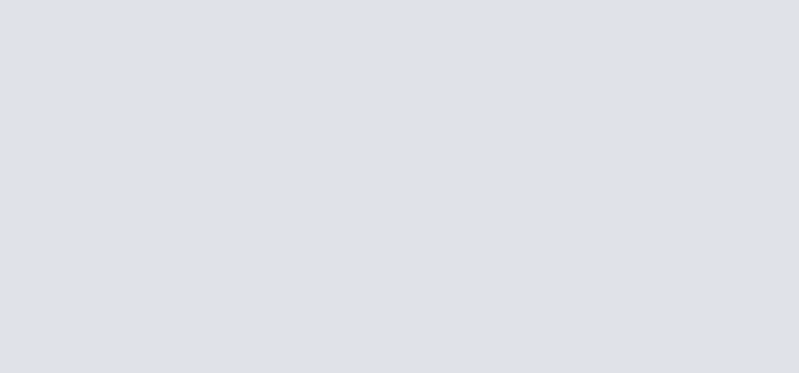
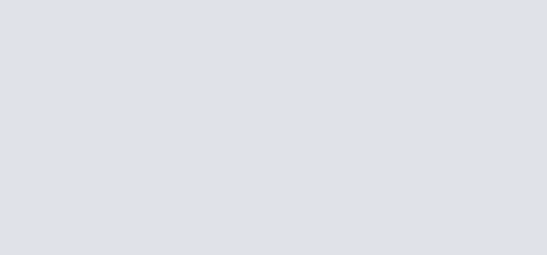

# Input Forge - tutorials

End-to-end walkthroughs. Requires **Godot 4.7+**. See the
[API reference](api-reference.md) for exact signatures and the
[examples](https://github.com/julienandreu/input_forge/tree/main/examples) for runnable scenes.

## 1. Configure your controls in the InputMap

Define your actions in `Project > Project Settings > Input Map` as usual
(e.g. `move_left/right/up/down`, `jump`, `dash`).

For multiple keyboard players, bind **one key per zone** to each action: the Nth
keyboard event of an action becomes keyboard zone N. Example - bind `jump` to
`Space` (zone 0) and `Enter` (zone 1); `move_left` to `A` (zone 0) and `Left`
(zone 1). Add a gamepad event (button/axis) to each action too.

To script the InputMap from code (project bootstrap or tests), use
`InputForgeMapWriter`:

```gdscript
InputForgeMapWriter.set_action(&"jump", [
    InputForgeMapWriter.key(KEY_SPACE),
    InputForgeMapWriter.key(KEY_ENTER),
    InputForgeMapWriter.button(JOY_BUTTON_A),
])
InputForgeMapWriter.save()  # persists project.godot
```

## 2. Use the Input Forge dock

Enable the plugin (`Project > Project Settings > Plugins`). In Godot 4.7 the dock
registers as a native `EditorDock` titled **Input Forge** (left, upper-right slot)
that you can move and float.



Create or assign an `InputForgeActionSet`, pick the four movement actions, the
join action, and the ordered button actions from the dropdowns (populated from
your InputMap), then **Apply + Save**. The dock previews the per-device bindings
Input Forge derives.



> Screenshots above are captured from the running editor - see
> [`docs/images/README.md`](images/README.md) for what to capture.

## 3. Couch co-op (local multiplayer)

The core loop: a join listener hands you a device + profile; you create one
`InputForgeDeviceSource` per device and poll it each physics tick.

```gdscript
var actions := InputForgeActionSet.new()
actions.move_left = &"move_left" ; actions.move_right = &"move_right"
actions.move_up = &"move_up" ; actions.move_down = &"move_down"
actions.buttons = [&"jump", &"dash"]
actions.join_action = &"jump"

var listener := InputForgeJoinListener.new()
listener.action_set = actions
add_child(listener)
listener.join_requested.connect(func(device, profile):
    var source := InputForgeDeviceSource.new(device, profile, actions)
    add_child(source)
    # Attach `source` to a player; each physics tick:
    #   var cmd := source.poll()
    #   move_player(cmd.move)
    #   if cmd.is_pressed(&"jump"): jump()
)
```

A complete, runnable version is in
[`examples/couch_coop`](https://github.com/julienandreu/input_forge/blob/main/examples/couch_coop/couch_coop.tscn).

## 4. Networking (authoritative server)

`InputForgeCommand` streams compactly: a move vector, a held bitmask, and per
-button wrapping 8-bit press counters. On the server, `InputForgeNetworkSource`
turns counter deltas back into press edges and drains one press per button per
tick, so an isolated press survives a dropped packet.

```gdscript
# server side, per remote player:
var server := InputForgeNetworkSource.new()
server.action_set = actions
# each packet (use an ordered channel, e.g. unreliable_ordered):
server.apply(move, held_mask, counters)   # counters: PackedByteArray
var cmd := server.poll()                    # reconstructed edges
```

Keep the action set to at most `InputForgeActionSet.MAX_BUTTONS` (32) when
streaming. A runnable, narrated demo (including a recovered dropped press) is in
[`examples/netcode/netcode_demo.gd`](https://github.com/julienandreu/input_forge/blob/main/examples/netcode/netcode_demo.gd).

## 5. Rebinding and persistence

Use `InputForgeRebindCapture` to capture the next key/button/axis, then persist
with `InputForgeBindingsStore`:

```gdscript
var capture := InputForgeRebindCapture.new()
add_child(capture)
capture.key_captured.connect(func(keycode):
    profile.keyboard[action] = keycode
    InputForgeBindingsStore.save_profile(device, profile)
)
capture.arm(device)   # disarm() to cancel
```

`InputForgeBindingsStore.load_profile(device, defaults)` layers stored overrides
on top of the derived defaults at load time.

## 6. Device prompts / icons

The default `InputForgeIconProvider` returns text labels ("KB0", "P1", ...) and a
ready-to-add prompt `Control`. Subclass it to inject your own art:

```gdscript
class_name MyIcons extends InputForgeIconProvider
func texture_for(device: InputForgeDeviceId) -> Texture2D:
    return my_art_for(device)  # return null to fall back to a text label
```
